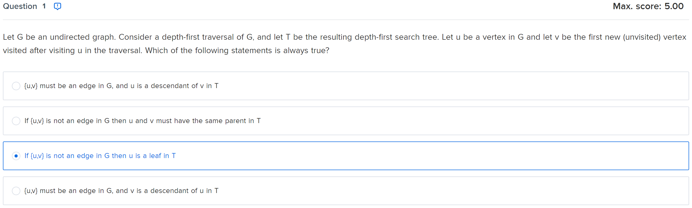
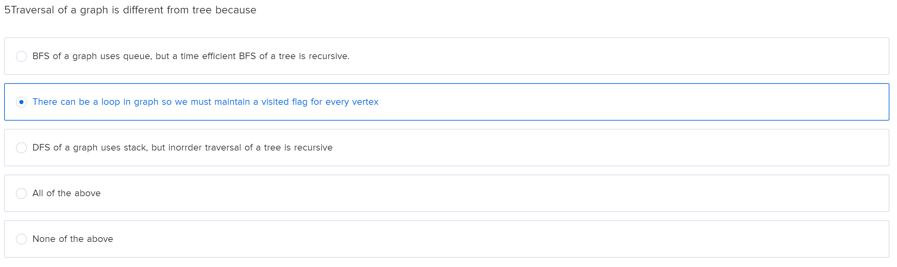
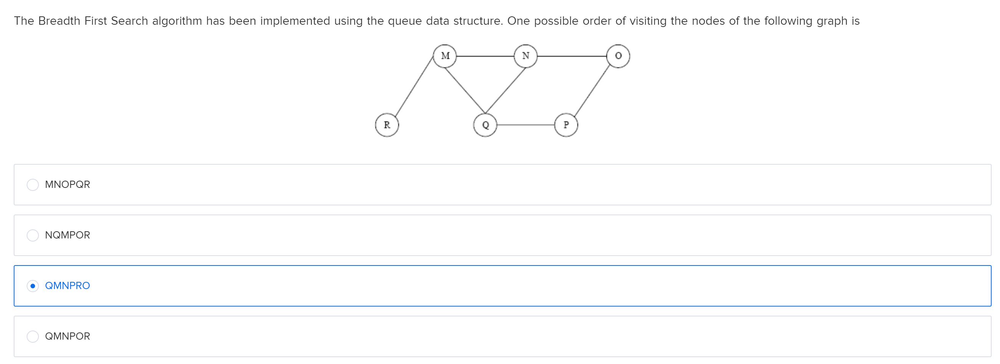
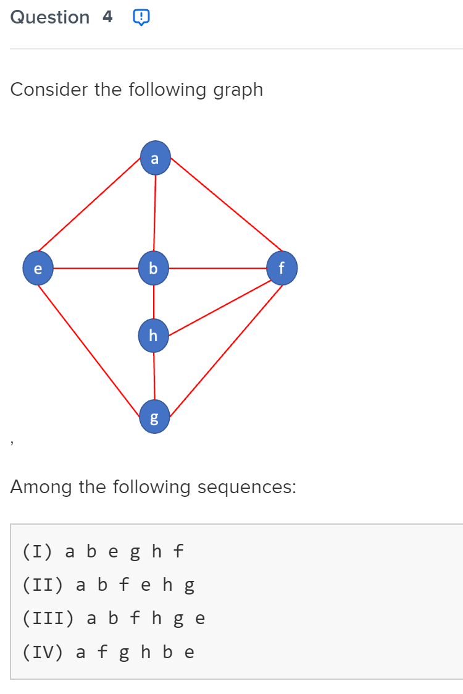
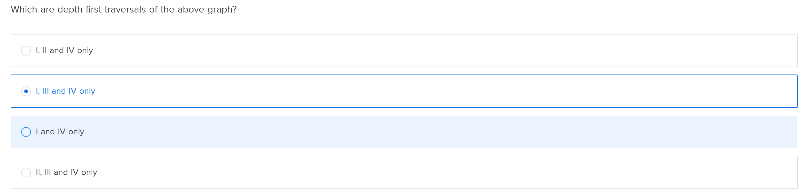
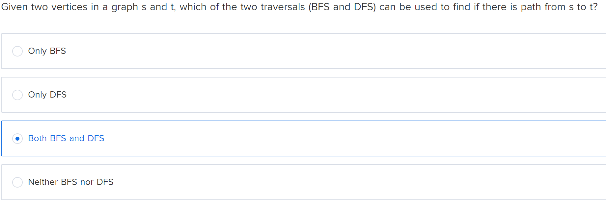

## Notes for iterative search algorithms

### BFS:
#### Data Structures used:
- Queue to track which node to track back up to
- Hashset (or Array) to track visited nodes 
#### Pseudo-code
```
function BFS(Graph G, Vertex v):
    create Queue q
    enqueue v onto q
    mark v as visited (G.visited[v] = 1)
    while q not empty:
        current_vertex = dequeue(q)
            (for each unvisited vertex u adjacent) ->
            for each element in matrix, if matrix element not 0 AND adjacent element is 0:
            mark u as visited
            enqueue u into Q
    
```

### Application of BFS
### Shortest distance
### Pseudo-code
```
function BFS(Graph G, int start, int end)
    Queue q
    mark start as visited
    enqueue start
    while q not empty:
        current = dequeue
        if current == end
            return visited[end] - 1
        for each neighbour in adj matrix:
            if neighbour not 0 and not visited before
                visited[neighbour] = visited[current] + 1
                enqueue neighbour
    return -1;
```
### C code
``` c
int SD(Graph g, int v, int z)
{
    // create q
    Queue q;
    q.head = NULL;
    q.tail = NULL;
    q.size = 0;
    // initialise vertices
    int start_vertex = v-1;
    int end_vertex = z-1;
    // set start visited to 1
    g.visited[start_vertex] = 1;
    
    enqueue(&q, start_vertex);

    while (!isEmptyQueue(q))
    {
        int current_vertex = dequeue(&q);
        if (current_vertex == end_vertex)
            return g.visited[current_vertex] -1;
        // explore other neighbours, i is the neighbour
        for (int i=0; i<g.V; i++)
        {
            if(g.matrix[current_vertex][i] == 1 && g.visited[i] == 0)
            {
                g.visited[i] = g.visited[current_vertex] + 1;
                enqueue(&q, i);
            }
        }
    }
    return -1;
}
```

### DFS:
#### Data Structures used:
- Stack to track which nodes to pop back up to
- Array/Hashset to store visited
#### Pseudo Code
``` pseudo
function dfs(graph, start):
    Stack s;
    initialize graph.visited to 0;
    push(start)
    while stack not empty:
        current = peek(s)
        has_unvisited = 0
        // visit neighbours
        for each neighbour in current row
            if connection exists and not visited before:
                neigbour.visited = 1
                push(neighbour)
                has_unvisited = 1
                break
        if !has_unvisited:
            pop(s)
```
#### C code
```c
void dfs(Graph g, int start)
{
    Stack s;
    s.head=NULL;
    s.size=0;
    // reset visited arr to 0
    for (int i=0; i<g.V; i++)
    {
        g.visited[i] = 0;
    }
    // push to stack
    push(&s, start);
    g.visited[start] = 1;
    while(!isEmptyStack(s))
    {
        int current_vertex = peek(s);
        int has_unvisited = 0;
        // check if neighbours are unvisited
        for (int i=0; i<g.V; i++)
        {
            if (g.matrix[current_vertex][i] && !g.visited[i])
            {
                push(&s, i);
                g.visited[i] = 1;
                has_unvisited = 1;
                break; // make sure to break to go deeper first!
            }
        }
        if (!has_unvisited)
        {
            pop(&s);
        }
    }
}
```
#### Sample use case: Connection in directed graph
```c
int Connected(Graph g)
{
    // perform dfs for each vertex
    for(int i=0; i<g.V; i++)
    {
        dfs(g, i);
        for (int j=0; j<g.V; j++)
        {
            if (!g.visited[j])
            {
                return 0;
            }
        }
    }
    return 1;
}

```

#### Sample use case: Connection in UNDIRECTED graph
```c
int Connected (Graph g)
{
    //write your code here
    // choose any vertex
    int random = 0;
    dfs(&g, random);
    for (int i=0; i<g.V; i++)
    {
        if(g.visited[i] == 0)
            return 0;
    }
    return 1;
}
```

## MCQ from Assignment





