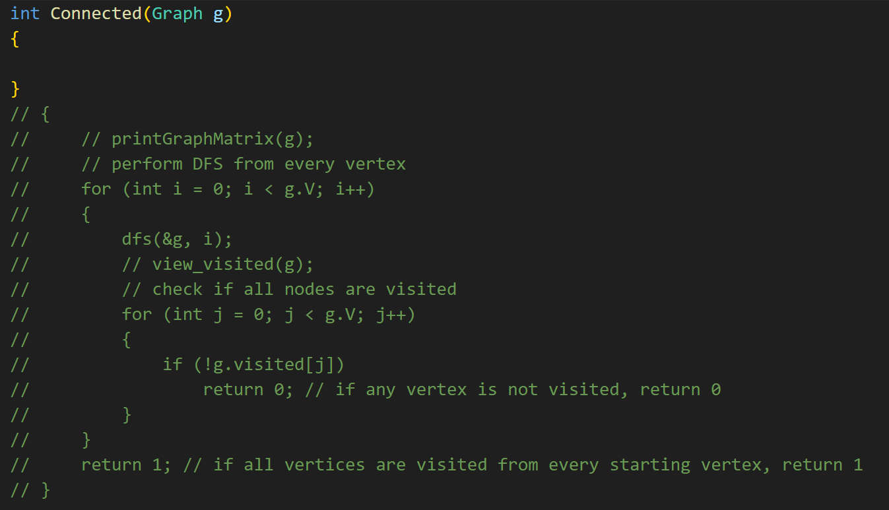

## HOW TO STUDY THIS COURSE

1. Don't just copy blindly first, spend 30 mins trying to understand the business problem (yes, you heard me, the business problem), understand it at a high level FIRST (what is the goal?)
2. Read the comments and code (abour 30 mins), try to understand the logic and how the data structure is being applied
3. Once you understand the code, just copy the code 3-5 times, u can do so by commenting out my worked solution and rewriting it over and over again

4. Just keep copying it until u undersand 70% of it.
5. Hide the worked solution and try to write out the worked example from memory. this will force u to understand the concepts from the code.
6. Rinse n repeat until crispy and golden brown

## You will get to the point where u don't even need to look at bfs/dfs code to explain what it does. ur gonna be a leetcode god after this mod :) ENjoy~